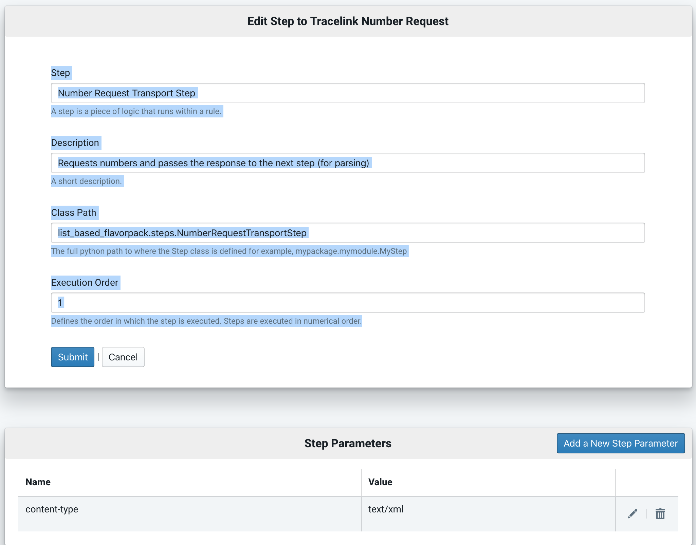
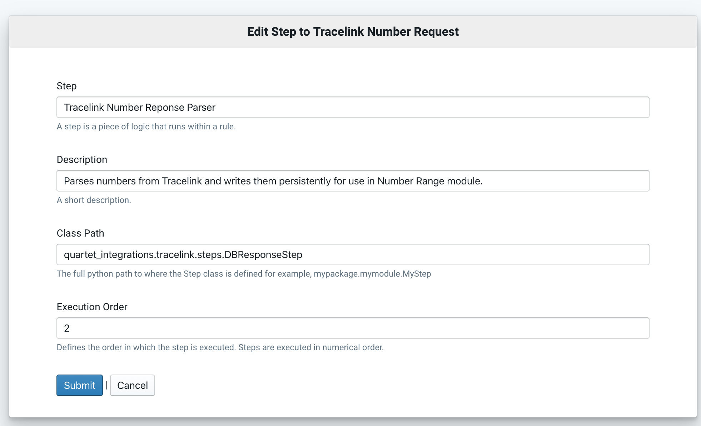

Number Pools
------------

TL;DR
=====

Navigate to the root direcotory of your QU4RTET installation and
run the setup_tracelink management command form the terminal:

.. code-block:: text

    python manage.py setup_tracelink

This will install an example output rule (not covered here) and an example
number range configuration that will be the framework for getting QU4RTET to
talk to an external tracelink system.

 If you'd like to know more about
what's going on, follow the outline below:

The Tracelink Number Request Rule
=================================

QU4RTET, in case you haven't noticed, usually levereages its internal
rule engine framework for most things and for requesting numbers from other
systems this is no different.  For most types of external serial number
requests, these requests will be initiated by a *Request Rule*.

The setup_tracelink command will set up a Request Rule for you.  If you need
to set one up manually, you will need to create a rule with two steps:

Step 1: Number Request Transport Step
+++++++++++++++++++++++++++++++++++++
The first step takes the data in the rule (which is sent by a list-based
region in serial-box...more on this later) and sends it to tracelink.  This
data is usually a SOAP request being posted to tl's number issuing API.

The first step should have the following parameters:

**Number Request Transport Step**

*Description*:

Requests numbers and passes the response to the next step (for parsing)
A short description.

*Class Path*

list_based_flavorpack.steps.NumberRequestTransportStep

*Order*

1

** Step Parameters **

The transport step can add certain HTTP header values to HTTP requests.
For a tracelink request, set the

Step 2: Number Response Parser
++++++++++++++++++++++++++++++

If all goes well with the execution of the step above, the second step
will now be fed the response from the tl server by placing the tl response
on the *Rule Contex* under the key ..code: `NUMBER RESPONSE` .  Since this response will
most likely need to be forwarded to other systems at a later time, this step
will persist the returned tl numbers to file or a database depending on
your configuration.

*Step*:

Tracelink Number Reponse Parser

*Class Path*:

quartet_integrations.tracelink.steps.DBResponseStep

*Order*:

2

